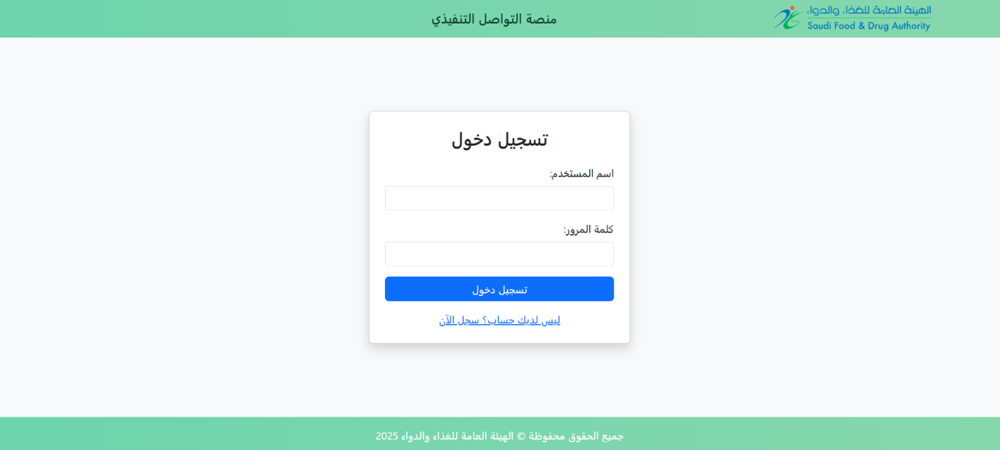
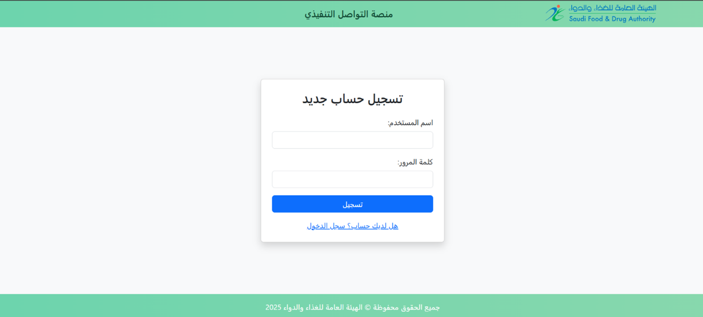
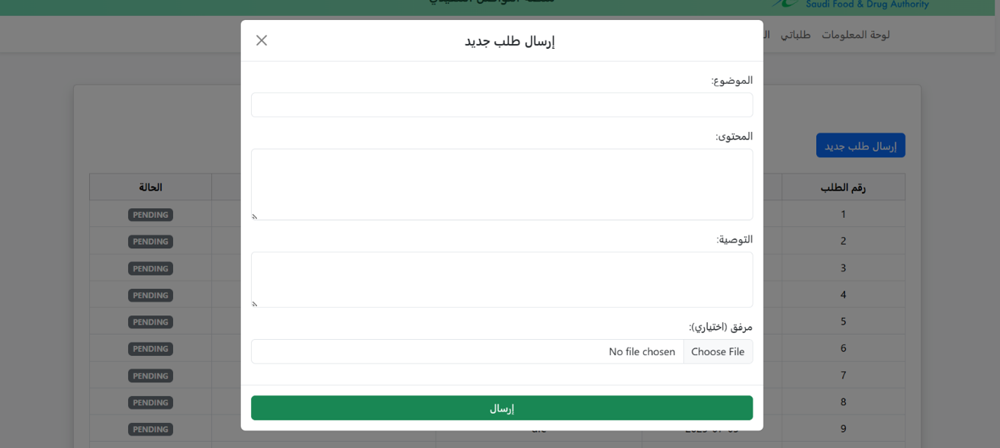
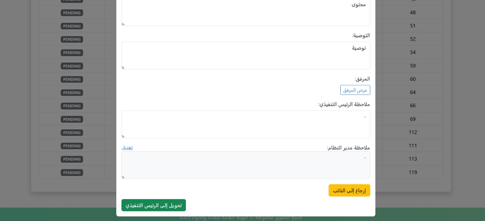
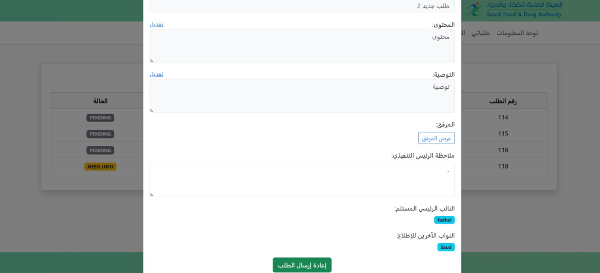
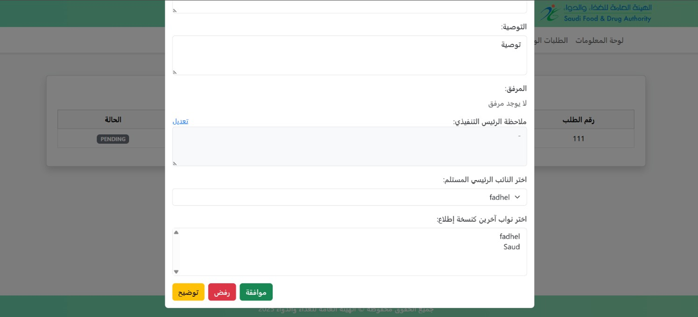
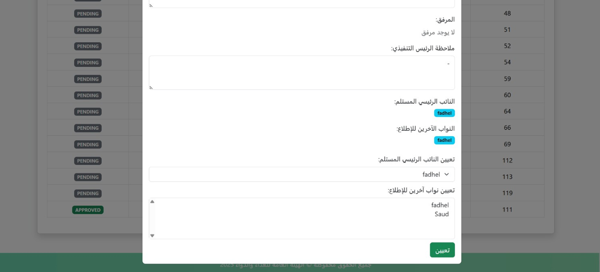

# Executive Communication Platform (ECP)

## Project Overview
The **Executive Communication Platform** is designed to modernize and streamline the communication process within an organization, specifically for managing requests and decision-making between **VPs, Admins, and CEOs**.  
Traditionally, these communications rely heavily on email, which can lead to delays, lack of traceability, and difficulty in archiving important requests. This platform introduces a **new approach** that improves:

- **Traceability:** Every request and response is tracked for accountability.  
- **Archiving:** Requests and decisions are stored for easy retrieval.  
- **Productivity:** Streamlined workflow reduces delays and manual effort.  

## Features
- Request submission by VPs.  
- Admin evaluation and management of requests.  
- CEO review and decision-making (approve, reject, request clarification).  
- Centralized system to replace traditional email-based communication.  
- Dashboard for tracking request status.  

## Tech Stack
- **Backend:** Spring Boot, Spring Security, Spring Data JPA, Thymeleaf.
- **Frontend:** HTML, CSS, JavaScript, Bootstrap.
- **Database:** MySQL  

## Visuals
### 1. Login Page
Entry point for all users: **VPs**, **Admin**, **CEO**.

### 2. Registration Page
Allows new users, especially **VPs**, to create an account.

### 3. VP Request Form
VPs can submit new requests to the admin for review, including all necessary details.

### 4. Admin Request View
Admin can:
- **Transfer to CEO**: escalate the request
- **Return to VP**: request more info or revision

### 5. Returned Request View
VP reviews or responds to a request returned by admin.

### 6. CEO Decision Page
CEO reviews requests and provides a final decision.

### 7. Admin Assignment Interface
Admin assigns requests to appropriate **VPs**.

## Note
(This repository contains **visual assets and project documentation only**. The source code is confidential and not publicly shared).

